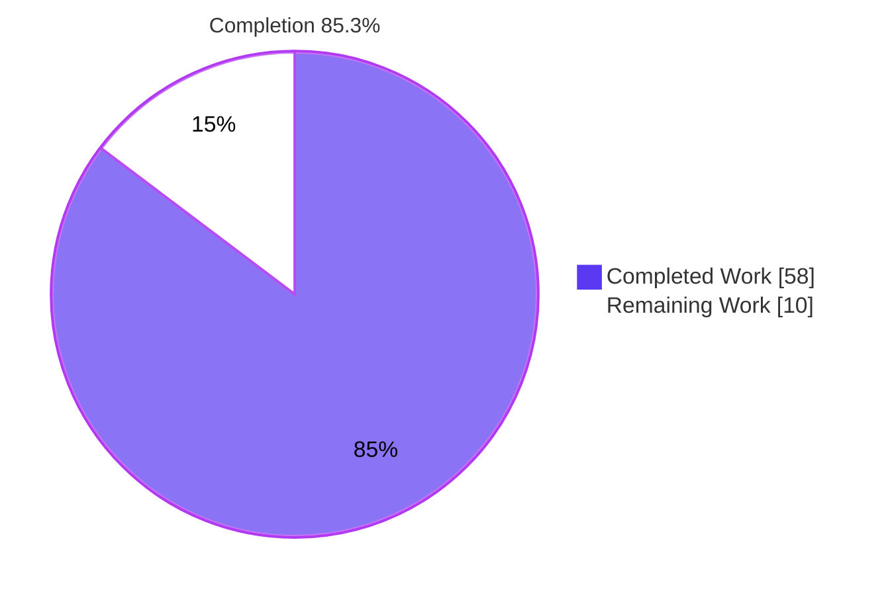
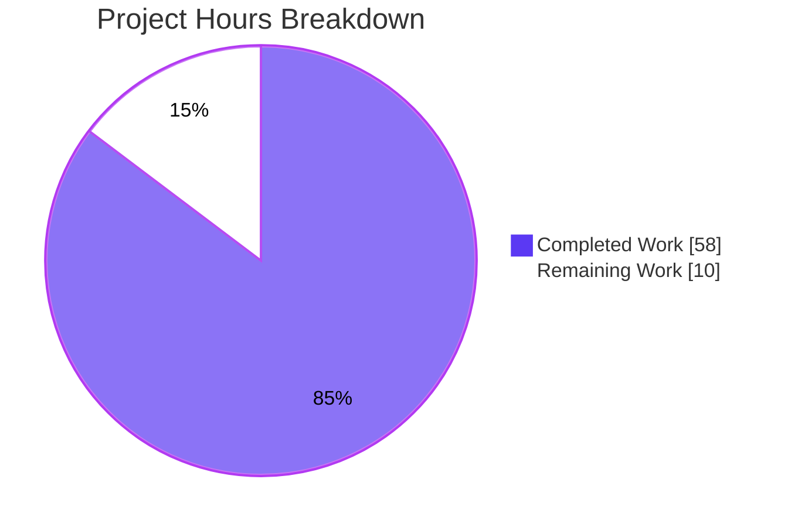
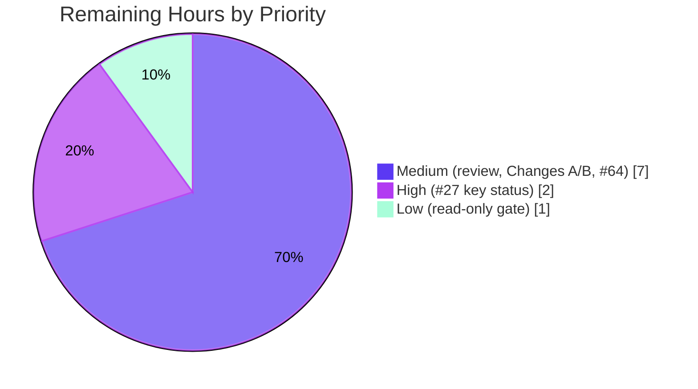

# 1. Executive Summary

## 1.1 Project Overview

`snyk-findings-analysis.md` is a read-only security triage of all 84 Snyk Code results in `results.sarif` for TruffleHog (`github.com/trufflesecurity/trufflehog/v3`). It is written for the project's developers and security reviewers. Each verdict is argued from the code at commit `73890ab3c`, not from the scanner's message, so real weaknesses can be acted on and the noise dismissed with evidence. The single file at the repository root holds a summary, a reading guide, 84 per-finding entries grouped by severity and verdict, a Blitzy prompt to fix the 12 true positives, and the scan's limitations. Nothing else changes.

## 1.2 Completion Status



| Metric | Value |
| --- | --- |
| Total Hours | 68 |
| Completed Hours (AI + Manual) | 58 (58 AI + 0 manual) |
| Remaining Hours | 10 |
| Percent Complete | 85.3% |

58 of 68 hours are complete, which is 85.3%. The remaining 10 hours are owner decisions and sign-off.

## 1.3 Key Accomplishments

- ✅ All 84 SARIF results triaged one by one, each with seven fields, a code-grounded verdict and its `fingerprints.identity`.
- ✅ 12 true positives (#53–#63, #65), 71 false positives and 1 needs manual review (#27). The summary tables match per severity.
- ✅ Snyk's "request URL" and "reader" labels replaced with the real input origin.
- ✅ All 48 credential-shaped test literals described by length and shape; none is reproduced.
- ✅ Terms, the Snyk-sourced severity mapping and the trust model each stated once.
- ✅ Copy-ready Blitzy prompt on the user's template: 19 fixed lines verbatim, 12 result lines, and Changes A–C with their residual risks.
- ✅ Only `snyk-findings-analysis.md` differs from `73890ab3c`, and `results.sarif` is byte-identical.
- ✅ The validator, secret scan, render check and markdownlint all pass on the final file.

## 1.4 Critical Unresolved Issues

5 items are open: 2 of the 84 findings, 2 of the 3 proposed code changes, and 1 of the 5 verification checks. None of them blocks publishing the triage.

| Issue | Impact | Owner | ETA |
| --- | --- | --- | --- |
| #27 (1 of 84 findings): a complete Google Cloud service-account key is committed as a test fixture (`pkg/detectors/docker/docker_auth_config_test.go:229-241`). The repository cannot show that it has been revoked. | If the key is live, a usable cloud credential is public. The verdict stays "Needs manual review". | Security lead, with the key owner | 2 h once the owner responds |
| #64 (1 of 84 findings): a false positive for the flow Snyk reports, but the Pusher request follows provider redirects unchecked (`pkg/detectors/pusherchannelkey/pusherchannelkey.go:32`, `:142`). A fix is recommended outside the prompt (Section 5.2, D3). | A blind SSRF path stays in the detector until the owner decides. | Security lead | 1.5 h |
| Changes A and B (2 of 3): the prompt adds steps labelled "Added hardening" beyond the planned AAP §0.4.6 changes. Change B also states a remaining 100.64.0.0/10 gap (D1, D2). | Do not run the prompt until the owner accepts or drops the added steps. | Engineering owner | 2 h |
| Read-only check (1 of 5 checks): `readonly-check.sh` cannot print `READONLY_OK` without an untracked file that existed before the document was written. Git proves each condition it tests (D6). | The gate prints `POST_CHECKS_FAILED: read-only` even though only the document changed. | Release manager | 1 h |

## 1.5 Access Issues

| System/Resource | Type of Access | Issue Description | Resolution Status | Owner |
| --- | --- | --- | --- | --- |
| Google Cloud project behind result #27 | Administrative confirmation from the key owner | Only the key's owner or Google Cloud can confirm that the committed service-account key is disabled. The key must never be tested live. | Unresolved | Security lead |
| Snyk Code API (`${SNYK_TOKEN}`) | API token | Needed only for the prompt's re-scan check in a later run. No token is configured, and none is needed for this deliverable. | Not required now | Engineering owner |

## 1.6 Recommended Next Steps

1. [High] Get evidence from the key owner or Google Cloud that the #27 key is disabled. If it is live, revoke and rotate it.
2. [Medium] Have a security owner sign off the 84 verdicts, then merge.
3. [Medium] Before running the prompt, accept or drop the "Added hardening" in Changes A and B.
4. [Medium] Decide whether the Pusher redirect fix for #64 joins the Blitzy run.
5. [Low] Accept the git proof of read-only delivery, or patch `readonly-check.sh` so that it accepts an empty untracked-file list.

# 2. Project Hours Breakdown

## 2.1 Completed Work Detail

| Component | Hours | Description |
| --- | --- | --- |
| Scan analysis and reader guidance (AAP 0.4.1, 0.4.2) | 6 | SARIF enumeration (84 results, 10 rules, 9 / 13 / 62 levels); title and metadata; both Summary tables; Terms; severity mapping cited to Snyk, with the Critical bucket empty; verdict criteria and trust model; ten-row rules table with MITRE CWE titles and the two Snyk public-name differences |
| High findings: process execution and Git path reads (#0, #35–#42) | 7 | Traced `syscall.Exec` argument origin (`main.go:302-361`) and the operator URI chain through `pkg/sources/git/git.go` to each sink. Documented clone isolation and both operator opt-outs: `--trust-local-git-config` and pre-commit-hook mode (`main.go:896-902`). Stated the `gitdir`/`commondir` residual |
| Medium findings: outbound requests and TLS (#53–#65) | 10 | ngrok pagination SSRF (response-supplied `next_page_uri`, Bearer key); Docker registry verification SSRF (content-supplied host, no local-address guard); Pusher fixed-host flow plus its unreported redirect weakness; opt-in Jenkins TLS bypass, with accepted-risk context and `SECURITY.md` policy |
| Low findings: developer tool, test cleanup and hashes (#10–#12, #33, #43–#52) | 5 | Generator argument from a trusted developer (both invocation modes), cleanup in tests of paths the tests created, and SHA-1/MD5 uses that store no password |
| Low findings: credential-shaped test literals (48 results, #27 included) | 12 | One entry per literal, grounded in the consuming test (offline, parse-only, mock, integration, not-a-credential). Each value is described by length and shape, never quoted. #27 is marked Needs manual review, with the missing revocation evidence and the Technical Specification §6.6.2.4 conflict named |
| Blitzy fix prompt for the 12 true positives (AAP 0.4.6) | 10 | Intro paragraph, A–C change table, and one 95-line `text` fence on the user's template: 19 fixed lines, 9 answers, 12 result lines. Planned changes and labelled added hardening. Security and regression tests. Scanner check writing outside the checkout. The B behaviour change and the B and C residuals |
| Scan coverage and limitations (AAP 0.4.1) | 1.5 | The unnamed `FAILED_PARSING` file, 84-result scope, unrecorded scanned revision, citations checked at `73890ab3c`, Technical Specification §6.4.4.5 discrepancies, and the README `--sarif` distinction |
| Verification and formatting (AAP 0.7, 0.9.1) | 6.5 | Validator, whole-file secret scan, markdown-it render check and markdownlint on the final file. Git proof of read-only delivery. Manual checks for literals below the scanner's heuristic. Cited lines checked against the tree |
| **Total** | **58** | |

## 2.2 Remaining Work Detail

| Category | Hours | Priority |
| --- | --- | --- |
| #27 key status: get disabled-key evidence from the owner or Google Cloud, rotate if live, decide what happens to the fixture | 2 | High |
| Security-owner review and sign-off of the 84 verdicts, then merge | 3.5 | Medium |
| Accept or drop the "Added hardening" in Changes A and B, and decide whether changes to `pkg/detectors/http.go` (100.64.0.0/10, pinned dial, proxy target) join the Blitzy run | 2 | Medium |
| #64 Pusher redirect: keep it a false positive with its recommendation, or reclassify it and add the fix to the Blitzy run | 1.5 | Medium |
| Read-only gate: accept the git proof, or patch `readonly-check.sh` to accept an empty untracked list and rerun the gate | 1 | Low |
| **Total** | **10** | |

## 2.3 Hours Calculation

- Completed: 6 + 7 + 10 + 5 + 12 + 10 + 1.5 + 6.5 = **58 h**
- Remaining: 2 + 3.5 + 2 + 1.5 + 1 = **10 h**
- Total: 58 + 10 = **68 h**; completion = 58 / 68 × 100 = **85.3%**
- Confidence: high for completed hours, because the deliverable is fixed and measured. Medium for remaining hours, because #27 depends on how fast an outside party responds.

# 3. Test Results

Every row below was run against the final `snyk-findings-analysis.md` (SHA-256 `5facf6d2…8793`, 1,085 lines) inside the pinned Ubuntu 24.04 toolchain image, and each result was observed directly.

| Area / Category | Framework | Tests | Passed | Failed | Coverage | What This Proves |
| --- | --- | --- | --- | --- | --- | --- |
| Toolchain pinning | AAP §0.9.1 environment-verification block (bash) | 1 check (`ENV_OK`) | 1 | 0 | Platform, 16 apt packages, 5 prefix tools, npm global set | The checks run on exactly the versions the AAP pins |
| SARIF input | jq 1.7.1 | 3 counts | 3 | 0 | 84 results; error 9 / warning 13 / note 62; 10 rules | The input matches what the triage states |
| Entry structure and verdict map | `validate-report.mjs` (Node 22.23.2) | 84 entries | 84 | 0 | 84 of 84 results; both Summary tables; 12 prompt result lines | Each result has one correctly placed seven-field entry tied to its SARIF index and fingerprint. Totals read 84 / 12 / 71 / 1 |
| Secret safety | `secret-scan.mjs` | 4,595 denylist values | 4,595 absent | 0 | 21 of 21 credential-flagged files, including encoded and decoded forms | No test credential literal, fragment or encoding appears in the document |
| Rendering and outline | `render-check.mjs` (markdown-it 15.0.2) | 1 file | 1 | 0 | 1 H1, 8 H2, 13 H3, 84 H4; 5 tables; 0 excerpts; 1 `text` fence | The document renders to the planned outline, with one prompt fence inside the fix section |
| Markdown lint | markdownlint-cli2 0.23.3 (markdownlint 0.41.1) | 1 file | 1 | 0 | All default rules; MD013 off | `Summary: 0 issues in 0 files` |
| Read-only delivery (git) | git | 6 conditions | 6 | 0 | Whole tree vs `73890ab3c` | Only `A snyk-findings-analysis.md` differs; `results.sarif` blob `6f01f59d5e57` is unchanged; worktree and index are clean; 0 untracked or ignored paths; no `.snyk` file |
| Read-only delivery (script) | `readonly-check.sh` | 1 check | 0 | 1 | — | Needs a snapshot taken before the document was written, and at least one pre-existing untracked file. Neither exists in this checkout. The row above proves each condition it tests |

**Not Covered**

- **Truth of the reasoning prose.** No automated check reads meaning. Citations and verdicts were checked by reading the cited lines at `73890ab3c`. A security reviewer should spot-check the 12 true positives and #64 before sign-off.
- **Family and index order inside each verdict bucket.** The validator passes a swapped pair of entries. The current order was checked separately; repeat that check after any edit.
- **Short plain-letter credential fields**, such as the #27 username, fall below the secret scan's heuristic. Their absence was confirmed by manual count only.
- **Proposed Changes A–C and their security and regression tests.** These were never compiled or run, as the AAP requires. Nor was the Snyk re-scan command run against the Snyk CLI.
- **The DNS-rebinding and proxy statements about `pkg/detectors/http.go`.** These rest on reading the code, not on a controlled-DNS test.
- **The #27 key's live status.** It was never tested, by design.

# 4. Runtime Validation & UI Verification

The deliverable is a Markdown document, so its runtime is the document toolchain. It has no user interface, HTTP surface or service. All checks ran in the `snyk-report-env:ubuntu24.04` container, which bind-mounts the checkout.

- ✅ **Toolchain start-up**: the container starts and environment verification prints `ENV_OK` (Node 22.23.2, npm 11.18.0, jq 1.7.1, git 2.51.0, markdownlint-cli2 0.23.3, markdown-it 15.0.2).
- ✅ **SARIF to document consistency**: the validator reads `results.sarif` and ties all 84 entries to their results (`VALIDATION_OK entries=84 TP=12 FP=71 NMR=1 remediation=12`).
- ✅ **Rendering**: markdown-it renders the planned outline, 84 result headings, 5 tables and one `text` fence (`RENDER_OK h4=84 tables=5 excerpts=0 prompt=1`).
- ✅ **Prompt extraction**: the `text` fence extracts to 95 plain-text lines that begin with the template header. It is inert text and was not executed.
- ✅ **Whole-file secret scan**: the scan covers the prompt fence as well (`SECRET_SCAN_OK files=21 denylist=4595`).
- ⚠ **Read-only gate**: the five-check block prints `POST_CHECKS_FAILED: read-only`, because no snapshot exists from before the document was written. Git proves each of its conditions (Section 3).
- ⚠ **Not exercised at runtime**: the TruffleHog binary, the Go build and test suites, the Snyk CLI, the proposed Changes A–C, and any live credential check. The AAP excludes all of these.
- ⚠ **UI**: not applicable, because the document has no screens. GitHub-flavoured rendering is covered by the markdown-it check and lint, not by a browser.

# 5. Compliance & Quality Review

## 5.1 Compliance Matrix

| # | AAP Deliverable | Benchmark | Status | Progress | Evidence |
| --- | --- | --- | --- | --- | --- |
| 1 | Single-file, read-only delivery (0.5, 0.8) | Only the triage document is added; inputs untouched | ✅ PASS | 100% | `git diff --name-status 73890ab3c HEAD` → `A snyk-findings-analysis.md`; `results.sarif` blob unchanged |
| 2 | Summary and reader guidance (0.4.1, 0.4.2) | Counts, terms, mapping, trust model, rules table | ✅ PASS | 100% | `snyk-findings-analysis.md:5-76`; tables read 84 / 12 / 71 / 1 |
| 3 | Per-finding entries (0.4.3, 0.7.1) | 84 of 84 entries, seven fields, index and fingerprint | ✅ PASS | 100% | Validator `entries=84` |
| 4 | Verdict map and grouping (0.3.1, 0.4.1) | TP → FP → NMR order within each severity; empty buckets say "None." | ✅ PASS | 100% | Validator placement checks; render outline 1/8/13/84 |
| 5 | Code-grounded reasoning (0.3.2, 0.7.2) | Flagged line, origin and control cited; taint labels corrected; residuals stated | ✅ PASS (checked by reading) | 100% | Sinks for all 13 call-site results; clause "Two operator-controlled settings skip it" in all 8 Git entries |
| 6 | Needs-manual-review use (0.3.2) | #27 names the missing evidence, and no key field is reproduced | ✅ PASS | 100% | `snyk-findings-analysis.md:958-968` |
| 7 | Secret safety (0.4.3, 0.7.2) | No literal, fragment or encoding from 21 files | ✅ PASS | 100% | `SECRET_SCAN_OK files=21 denylist=4595`; manual counts for short fields |
| 8 | Prompt template fidelity (0.4.6) | 19 fixed lines, 9 answers, 12 result lines, placeholders only | ✅ PASS | 100% | Validator `remediation=12`; only `${SECRET_NAME}`, `${SNYK_TOKEN}` and `${TEST_SECRET_FILE}` |
| 9 | Prompt content vs the planned changes (0.4.6) | Changes A–C as planned | ⚠ PASS with declared extensions | 90% | "Planned change" ×4 and "Added hardening" ×7 labels; see D1 and D2 |
| 10 | Scan coverage and limitations (0.4.1) | Parse failure, scope, revision, HEAD check | ✅ PASS | 100% | `snyk-findings-analysis.md:1078-1085` |
| 11 | Verification gate and formatting (0.4.4, 0.4.5, 0.9.1) | `POST_CHECKS_OK`; compact tables; no diagrams | ⚠ PARTIAL | 80% | 4 of 5 checks print pass lines; read-only proven with git (D6) |
| 12 | Rule 1: terse docstrings, no acceptance-criteria comments (0.10) | No generated code or comments | ✅ PASS | 100% | No `.go`, `.py`, `.js` or `.jsx` file changed; 0 HTML comments in the document |

## 5.2 AAP & Rule Divergences and Gaps

| # | What the AAP/Rule Required | What Was Delivered Instead | Why It Diverged | Impact | Remediation |
| --- | --- | --- | --- | --- | --- |
| D1 | Change A: one origin check in `fetchResources`, in `requests.go` only | The planned check, plus labelled added hardening: a userinfo refusal, a scoped `CheckRedirect` at `ngrok.go:72`, and unwrapped origin errors | The analyzer client has no redirect policy, so an allowed URL can still redirect off-origin | The prompt also touches `ngrok.go` | Owner accepts or drops the added steps before running the prompt |
| D2 | Change B: swap the fallback to `DetectorHttpClientWithNoLocalAddresses`, with the guard described as refusing local addresses on a 10 s timeout | The planned swap, plus a Docker-owned transport (pinned dial, proxy refusal). The rebinding, proxy and 100.64.0.0/10 gaps and the overridable timeout are stated | The AAP's description of the guard does not match `pkg/detectors/http.go` | The prompt asks for more than planned; one gap is left open | Owner accepts the added steps and decides on changes to `isLocalIP` and the dial guard |
| D3 | #64: false positive, no fix | False positive kept for Snyk's flow; the entry discloses a redirect-following SSRF and recommends a fix outside the prompt | The trust model treats provider responses as untrusted; the agreed counts were kept | A Low-severity blind SSRF is not in the prompt | Owner decides whether to reclassify #64 and fix it |
| D4 | F2 opt-out: `--trust-local-git-config` only; #33 runs "only through" `//go:generate`; optional `go` excerpts | Both Git opt-outs are named; direct generator invocation is noted; no excerpts | The code is broader than the AAP's wording; verbatim tabs fail MD010 | None; all verdicts unchanged | None |
| D5 | Prompt text as worded in 0.4.6 (intro, compliance grep, Change A test, scanner output path) | Wording accurate once committed; the test fails closed; the output path is a real `mktemp -d` directory | The AAP wording was inaccurate once committed, or unsafe to paste | Stronger and more precise; intent kept | None |
| D6 | 0.9.1: `POST_CHECKS_OK`, including `READONLY_OK`, on Ubuntu 24.04 | 4 of 5 checks pass in an Ubuntu 24.04 image; read-only proven with git | Host is Ubuntu 25.10; no snapshot exists; the script fails on an empty untracked list | The gate line reads `POST_CHECKS_FAILED: read-only` | Accept the git proof, or patch `readonly-check.sh` |

**D1: Change A extensions.** AAP §0.4.6 plans a single origin check in `fetchResources` (`pkg/analyzer/analyzers/ngrok/requests.go:190-209`) and leaves every other file alone. The prompt keeps that check as its "Planned change" and adds three labelled steps. It refuses URLs with userinfo. It passes a scoped `CheckRedirect` option at `pkg/analyzer/analyzers/ngrok/ngrok.go:72` through the existing options of `NewAnalyzeClient`, capping redirects at 10. It returns the origin error unwrapped from `fetchResources` and `determineAccountType`. The reason is in the code: `NewAnalyzeClient` sets no redirect policy (`pkg/analyzer/analyzers/client.go:35-51`), so an allowed ngrok URL could still redirect the request carrying the Bearer token off-origin. The owner must accept or drop these steps before the prompt is run.

**D2: Change B extensions and stated residual.** AAP §0.4.6 swaps the Docker fallback client for `detectors.DetectorHttpClientWithNoLocalAddresses`, and describes its dial guard as refusing local addresses on a flat 10 s timeout. The prompt keeps the swap and describes how the guard really behaves. It resolves the host, then dials the hostname again (`pkg/detectors/http.go:142-151`). It checks the address of an environment proxy, not the registry's (`:89`). Its 10 s timeout is only a default (`main.go:602-605`). The added hardening is a `sync.Once` copy of the shared client over a Docker-owned transport that dials only checked addresses and refuses proxies. 100.64.0.0/10 stays reachable, because `isLocalIP` (`:101-107`) omits it. Changing `isLocalIP` affects every detector, so that decision is the owner's.

**D3: Result #64 disclosure.** The AAP verdict map fixes #64 as a false positive with no fix. The entry keeps that verdict for the flow Snyk reports: a constant body goes to a fixed host, and the app ID and key are constrained by regular expressions (`pkg/detectors/pusherchannelkey/pusherchannelkey.go:35-36`, `:134`). It also discloses a separate weakness at the same call. The request goes out on `common.SaneHttpClient()` (`pkg/detectors/pusherchannelkey/pusherchannelkey.go:32`, `pkg/common/http.go:259-264`), which follows provider redirects to any address. The document's own trust model treats provider responses as untrusted, so this path meets its true-positive test as a Low-severity blind SSRF. The agreed counts were kept, and the owner decides whether to reclassify #64 and add the fix to the Blitzy run.

**D4: Triage wording broader than the AAP.** Three statements in the AAP are narrower than the code. For #35–#42, the AAP names only `--trust-local-git-config` as the way out of clone isolation, but `main.go:896-902` also sets it automatically in pre-commit-hook mode. Every Git entry therefore names both. For #33, the AAP says the generator runs only through `//go:generate`, but `pkg/analyzer/generate_permissions/generate_permissions.go:108-110` also accepts a direct invocation. The AAP allowed optional `go` excerpts, and none is included: a verbatim quote keeps Go's tab indentation, which markdownlint MD010 rejects. All verdicts are unchanged, and nothing needs to be done.

**D5: Prompt detail refinements.** Four details in AAP §0.4.6 differ in the delivered prompt, which keeps it accurate once the document is committed and safe to paste. The intro says the only repository change is this document, not that nothing changed. The compliance search excludes both `results.sarif` and the document, and matches only `go.sum`. The Change A security test adds a fail-closed recording `http.RoundTripper`, so a regressed check cannot reach 169.254.169.254 or a live host. The scanner check writes to `OUT_DIR="$(mktemp -d)"` instead of a placeholder path, and notes that Snyk does not model the transport guards. The intent of every step is kept, and nothing needs to be done.

**D6: Verification gate.** AAP §0.9.1 requires `POST_CHECKS_OK` on an Ubuntu 24.04 host. That includes `READONLY_OK`, checked against a snapshot taken before the document existed. This host runs Ubuntu 25.10, so the pinned toolchain runs in the `snyk-report-env:ubuntu24.04` image. That container holds no such snapshot, and the check could not pass even with one. The AAP expected a pre-existing untracked `metering-inventory.md`, which this checkout does not have, and `sha256sum --strict -c` exits 1 on an empty list. Git proves each condition directly (Section 3). Accept that proof, or patch `readonly-check.sh` to skip an empty list.

No divergence from Rule 1 was found. No code, docstring or comment was generated, and the prompt's testing answers are prose for a later run.

# 6. Risk Assessment

| Risk | Category | Severity | Probability | Mitigation | Status |
| --- | --- | --- | --- | --- | --- |
| A complete Google Cloud service-account key is committed in `pkg/detectors/docker/docker_auth_config_test.go:229-241`. It is live if it was never revoked. | Security | High | Unknown | Get disabled-key evidence from the owner or Google Cloud. If the key is live, revoke and rotate it. Never test it live. | Open |
| The 11 SSRF true positives stay in the code until the Blitzy prompt runs: ngrok pagination can send the analysed key to any host (low likelihood), and Docker verification sends blind GETs to hosts named in scanned content. | Security | Medium | Medium | Run the prompt once the owner accepts Changes A and B. Until then, `--no-verification` disables the Docker request path. | Open |
| The Pusher detector follows provider redirects unchecked (#64, `pkg/detectors/pusherchannelkey/pusherchannelkey.go:32`), and this path is not in the prompt. | Security | Low | Low | Owner decision. The recommended fix is a client that follows no redirects and refuses local addresses. | Open |
| The opt-in Jenkins TLS bypass (#65, `pkg/roundtripper/roundtripper.go:126`, flag at `main.go:262`) is kept by design, so a re-scan still reports it. | Security | Medium | Low | Change C logs a warning whenever the switch is on. Removing the switch would change the CLI and is the owner's decision. | Accepted |
| The shared detector guard re-resolves the hostname before dialling, checks a proxy's address instead of the target's, and does not refuse 100.64.0.0/10 (`pkg/detectors/http.go:89`, `:101-107`, `:142-151`). This affects every detector that uses it. | Security | Medium | Low | Decide whether to fix `isLocalIP` and the dial path in `pkg/detectors/http.go`, outside this prompt's scope. | Open |
| The code proposed in Changes A–C has never been compiled or tested, and the added hardening may conflict with the current APIs. | Technical | Medium | Medium | The Blitzy run must pass the prompt's security tests, `CGO_ENABLED=0 go test` on the named packages, and `make check`. Review the output before merging. | Open |
| The citations are pinned to `73890ab3c`, the scanned revision is not recorded, and one `.go` file failed to parse, so findings in it are missing. | Operational | Low | Medium | Re-run the validator after any code change or re-scan, and treat the unparsed file as unscanned. | Monitor |
| The document checks do not enforce entry order or catch short plain-letter literals, and the read-only script fails when the untracked list is empty. | Operational | Low | Medium | Repeat the order and literal checks by hand after edits, and patch `readonly-check.sh`. | Open |

# 7. Visual Project Status



Remaining hours by priority (10 h in total, matching Section 2.2):



| Category (Section 2.2) | Hours | Priority |
| --- | --- | --- |
| Security-owner review and merge | 3.5 | Medium |
| #27 key status | 2 | High |
| Changes A/B decisions | 2 | Medium |
| #64 Pusher decision | 1.5 | Medium |
| Read-only gate | 1 | Low |

# 8. Summary & Recommendations

The project is 85.3% complete: 58 of 68 hours. Every deliverable the AAP defines is in `snyk-findings-analysis.md` and verified. All 84 Snyk Code results have their own code-grounded entry. The verdict split is 12 true positives, 71 false positives and 1 needs manual review, and the Summary tables match it per severity. The reading guide defines every term the entries use, and the Blitzy prompt on the user's template is ready to paste. The validator, whole-file secret scan, render check and markdownlint all pass on the final file. Git shows that the document is the only path added on top of `73890ab3c`.

The verdicts show where the real risk sits. Every High-severity result is a false positive, because each flagged input comes from the operator. The 12 true positives are all Medium. Eight are ngrok analyzer pagination, where a URL from the provider's response receives the analysed key. Three are Docker registry verification, where a host named in scanned content receives a blind request. The last is the opt-in Jenkins TLS bypass. Result #27 is the one open verdict. A complete third-party cloud key is committed as a test fixture, and its revocation cannot be shown from the repository.

What remains is owner work, not writing. The critical path to release is:

1. confirm the status of the #27 key;
2. have a security owner sign off the verdicts and merge;
3. before anyone runs the prompt, accept or drop the labelled "Added hardening" in Changes A and B, and decide on #64's redirect weakness and on the shared-guard gaps in `pkg/detectors/http.go`.

The read-only gate needs only an acceptance of the git proof, or a one-line script patch.

| Success metric | Target | Observed |
| --- | --- | --- |
| Results with an entry | 84 / 84 | 84 / 84 |
| Summary totals | 84 / 12 / 71 / 1 | 84 / 12 / 71 / 1 |
| Credential literals reproduced | 0 | 0 across 21 files |
| Template fixed lines verbatim | 19 / 19 | 19 / 19 |
| Lint issues | 0 | 0 |

**Production readiness.** The triage can be published once a security owner signs it off. The Blitzy prompt is ready for a separate run once the owner accepts its labelled extensions. That run's results must pass the prompt's own security tests and regression suites before they merge.

# 9. Development Guide

## 9.1 System Prerequisites

- A Linux host with Docker Engine; version 29.7.2 was used. The pinned toolchain runs inside the `snyk-report-env:ubuntu24.04` image (Ubuntu 24.04.5 LTS, about 1.15 GB), because AAP §0.9.1 accepts only Ubuntu 24.04 amd64.
- The `snyk-report-env` wrapper on `PATH`. It runs commands in a per-index container that bind-mounts the checkout at the same path.
- Git, and git-lfs for the repository's `git lfs pre-push` hook.
- Nothing else. The document work needs no Go, Python, Snyk CLI or secrets. The host's own `node` and `git` are not the pinned versions, and the host has no `jq`, so run every check through the wrapper.

## 9.2 Environment Setup

Run all commands from the repository root. Choose a `CLONE_INDEX` that no other checkout uses: the wrapper recreates any container that mounts a different checkout, and that discards its state.

```bash
cd "$(git rev-parse --show-toplevel)"
export CLONE_INDEX=0
snyk-report-env -c '. "$HOME/.cache/snyk-report-env/activate"; node --version; jq --version; git --version; markdownlint-cli2 --help | head -1'
```

Expected output:

```text
v22.23.2
jq-1.7.1
git version 2.51.0
markdownlint-cli2 v0.23.3 (markdownlint v0.41.1)
```

Environment verification: the platform and prefix-tool checks of the AAP §0.9.1 block. It must print `ENV_OK`.

```bash
snyk-report-env <<'BLOCK'
set -uo pipefail
. "$HOME/.cache/snyk-report-env/activate"
fail() { echo "ENV_FAILED: $1"; exit 1; }
. /etc/os-release; [ "$ID $VERSION_ID $(dpkg --print-architecture)" = "ubuntu 24.04 amd64" ] || fail platform
for t in node npm jq git markdownlint-cli2; do [ "$(command -v "$t")" = "$ENV_DIR/bin/$t" ] || fail "$t not in prefix"; done
[ "$(node --version)" = v22.23.2 ] || fail node; [ "$(npm --version)" = 11.18.0 ] || fail npm; [ "$(jq --version)" = jq-1.7.1 ] || fail jq
[ "$(git --version)" = "git version 2.51.0" ] || fail git
[ "$(markdownlint-cli2 --help | head -1)" = "markdownlint-cli2 v0.23.3 (markdownlint v0.41.1)" ] || fail markdownlint-cli2
[ "$(node -p "require('$ENV_DIR/lib/node_modules/markdown-it/package.json').version")" = 15.0.2 ] || fail markdown-it
echo ENV_OK
BLOCK
```

The complete AAP §0.9.1 verification block also pins the 16 apt package versions and the global npm package set. Paste it into the same heredoc for the full check.

## 9.3 Dependency Installation

No project dependency is installed or changed, and `go.mod`, `go.sum`, `package.json` and `backend/requirements.txt` are untouched. The image already holds the AAP §0.9.1 tool prefix (`$ENV_DIR`) with `activate`, `checks/validate-report.mjs`, `checks/secret-scan.mjs`, `checks/render-check.mjs`, `checks/readonly-check.sh` and `checks/.markdownlint-cli2.jsonc`. Do not rebuild, retag or prune the shared image.

## 9.4 Verifying the Document

After each edit, run the validator, the render check and lint:

```bash
snyk-report-env -c '. "$HOME/.cache/snyk-report-env/activate"; node "$ENV_DIR/checks/validate-report.mjs" results.sarif snyk-findings-analysis.md; node "$ENV_DIR/checks/render-check.mjs" snyk-findings-analysis.md; markdownlint-cli2 --config "$ENV_DIR/checks/.markdownlint-cli2.jsonc" snyk-findings-analysis.md'
```

Expected: `VALIDATION_OK entries=84 TP=12 FP=71 NMR=1 remediation=12`, `RENDER_OK h4=84 tables=5 excerpts=0 prompt=1` and `Summary: 0 issues in 0 files`.

The whole-package gate is the AAP §0.9.1 post-write block, which adds the secret scan and the read-only check:

```bash
snyk-report-env <<'BLOCK'
set -uo pipefail
. "$HOME/.cache/snyk-report-env/activate"
failed=""
node "$ENV_DIR/checks/validate-report.mjs" results.sarif snyk-findings-analysis.md || failed="$failed validator"
node "$ENV_DIR/checks/secret-scan.mjs" results.sarif snyk-findings-analysis.md || failed="$failed secret-scan"
node "$ENV_DIR/checks/render-check.mjs" snyk-findings-analysis.md || failed="$failed render"
markdownlint-cli2 --config "$ENV_DIR/checks/.markdownlint-cli2.jsonc" snyk-findings-analysis.md || failed="$failed lint"
bash "$ENV_DIR/checks/readonly-check.sh" || failed="$failed read-only"
[ -z "$failed" ] || { echo "POST_CHECKS_FAILED:$failed"; exit 1; }
echo POST_CHECKS_OK
BLOCK
```

On this committed branch it prints four pass lines, then `POST_CHECKS_FAILED: read-only` (see 9.7). Prove read-only delivery with git instead:

```bash
snyk-report-env <<'BLOCK'
set -euo pipefail
. "$HOME/.cache/snyk-report-env/activate"
git diff --name-status 73890ab3c HEAD
git diff --quiet HEAD && git diff --cached --quiet && echo CLEAN
echo "untracked=$(git ls-files --others | wc -l)"
[ "$(git rev-parse 73890ab3c:results.sarif)" = "$(git rev-parse HEAD:results.sarif)" ] && echo SARIF_UNCHANGED
[ ! -e .snyk ] && echo NO_SNYK_POLICY
BLOCK
```

Expected: `A	snyk-findings-analysis.md`, `CLEAN`, `untracked=0`, `SARIF_UNCHANGED`, `NO_SNYK_POLICY`.

## 9.5 Example Usage

List the SARIF results with the fields the entries cite. There are 84 rows; the first is `0	go/CommandInjection	error	main.go	361`.

```bash
snyk-report-env -c '. "$HOME/.cache/snyk-report-env/activate"; jq -r ".runs[0].results | to_entries[] | [.key, .value.ruleId, .value.level, .value.locations[0].physicalLocation.artifactLocation.uri, .value.locations[0].physicalLocation.region.startLine] | @tsv" results.sarif | head -5; jq -r ".runs[0].results | group_by(.level) | map(\"\(.[0].level) \(length)\") | .[]" results.sarif'
```

Find one result's entry and count the verdicts on the host. Expected: line 274, then `12`, `71` and `1`.

```bash
grep -n '^#### Result #61 ' snyk-findings-analysis.md
grep -c '^- \*\*Verdict:\*\* True positive$' snyk-findings-analysis.md
grep -c '^- \*\*Verdict:\*\* False positive$' snyk-findings-analysis.md
grep -c '^- \*\*Verdict:\*\* Needs manual review$' snyk-findings-analysis.md
```

Extract the Blitzy prompt to a directory outside the checkout, ready to paste into a separate Blitzy run. The file has 95 lines.

```bash
OUT_DIR="$(mktemp -d)"
awk '/^[`][`][`]text$/{f=1;next} /^[`][`][`]$/{f=0} f' snyk-findings-analysis.md > "$OUT_DIR/remediation-prompt.txt"
wc -l < "$OUT_DIR/remediation-prompt.txt"
```

## 9.6 Editing Rules

- Edit only `snyk-findings-analysis.md`. Any other new or changed path breaks the read-only guarantee.
- Keep the 19 fixed template lines and the 12 `Result #` lines inside the `text` fence unchanged. Never quote a credential literal: describe its length, shape and role.
- Use compact tables (`| --- |`), put a blank line around every heading, and add no `go` fence with hard tabs (MD010, MD060, MD022).

## 9.7 Troubleshooting

| Symptom | Cause | Resolution |
| --- | --- | --- |
| `POST_CHECKS_FAILED: read-only` with `pre-head: No such file or directory` | The container holds no snapshot from before the document was written, and the document is already committed | Run the git proof in 9.4. Do not create a placeholder untracked file. |
| `sha256sum: … no properly formatted checksum lines found` | The snapshot list is empty because the checkout had no untracked file, and `sha256sum --strict -c` exits 1 on an empty list | The same as above, or patch `readonly-check.sh` to skip an empty list |
| `snyk-report-env: set CLONE_INDEX=<0-based clone index>` | The variable is missing | Export `CLONE_INDEX` or prefix it on the command line |
| `mounts '…', not this checkout …; recreating it` | That index belongs to another checkout | Choose an unused index. Recreation drops that container's state. |
| Tool call hangs for 300 s | `docker exec -i` was called directly and drained the shell's stdin | Always go through the wrapper, with a heredoc or `-c` |
| `VALIDATION_FAILED n problem(s)` | An entry's fields, placement or citations, or the prompt lines, differ from the SARIF | Fix the named result indices and rerun 9.4 |
| `SECRET_MATCH results #… literal at <path>:<line> sha256:…` | A flagged test literal or fragment appears in the document | Replace it with a description. The message prints only a hash. |
| `jq: command not found` on the host | The host has no `jq` | Run it through the wrapper |

# 10. Appendices

## A. Command Reference

| Purpose | Command (run from the repository root) |
| --- | --- |
| Tool versions | `snyk-report-env -c '. "$HOME/.cache/snyk-report-env/activate"; node --version; jq --version; git --version'` |
| Validator | `snyk-report-env -c '. "$HOME/.cache/snyk-report-env/activate"; node "$ENV_DIR/checks/validate-report.mjs" results.sarif snyk-findings-analysis.md'` |
| Secret scan | `snyk-report-env -c '. "$HOME/.cache/snyk-report-env/activate"; node "$ENV_DIR/checks/secret-scan.mjs" results.sarif snyk-findings-analysis.md'` |
| Render check | `snyk-report-env -c '. "$HOME/.cache/snyk-report-env/activate"; node "$ENV_DIR/checks/render-check.mjs" snyk-findings-analysis.md'` |
| Lint | `snyk-report-env -c '. "$HOME/.cache/snyk-report-env/activate"; markdownlint-cli2 --config "$ENV_DIR/checks/.markdownlint-cli2.jsonc" snyk-findings-analysis.md'` |
| Result count | `snyk-report-env -c '. "$HOME/.cache/snyk-report-env/activate"; jq "[.runs[].results[]] \| length" results.sarif'` → `84` |
| Changed paths | `git diff --name-status 73890ab3c HEAD` → `A	snyk-findings-analysis.md` |
| Drop this index's container | `snyk-report-env --reset` |

## C. Key File Locations

| Path | Role |
| --- | --- |
| `snyk-findings-analysis.md` | The deliverable: the triage of all 84 results and the Blitzy prompt (fix plan at lines 970–1076, limitations at 1078–1085) |
| `results.sarif` | Snyk Code input (SnykCode 1.1307.3), 461,141 bytes of minified JSON; unchanged |
| `SECURITY.md` | Blind SSRF and outbound request policy, cited as impact context |
| `pkg/analyzer/analyzers/ngrok/requests.go` | Sites of results #53–#60; target of Change A |
| `pkg/detectors/docker/docker_auth_config.go` | Sites of results #61–#63; target of Change B |
| `pkg/detectors/docker/docker_auth_config_test.go` | Result #27 fixture (lines 226–241) and 9 other flagged literals |
| `pkg/roundtripper/roundtripper.go`, `pkg/sources/jenkins/jenkins.go` | Result #65 construct and its only caller; target of Change C |
| `pkg/detectors/pusherchannelkey/pusherchannelkey.go` | Result #64 and its disclosed redirect weakness |
| `pkg/detectors/http.go` | Shared no-local-address client and guard (`isLocalIP`, dial path) |
| `pkg/sources/git/git.go`, `main.go` | Results #35–#42 and #0, and the operator flags behind the trust model |

## D. Technology Versions

| Tool | Version |
| --- | --- |
| Toolchain image base | Ubuntu 24.04.5 LTS (amd64) |
| Node.js / npm | 22.23.2 / 11.18.0 |
| markdownlint-cli2 / markdownlint | 0.23.3 / 0.41.1 |
| markdown-it | 15.0.2 |
| jq | 1.7.1 |
| git (in the toolchain) | 2.51.0 |
| Scanner that produced the input | SnykCode 1.1307.3, SARIF 2.1.0 |
| Project module | `github.com/trufflesecurity/trufflehog/v3`, Go 1.25.0 (toolchain go1.25.10), not built for this work |

## E. Environment Variable Reference

| Variable | Where it is used | Purpose |
| --- | --- | --- |
| `CLONE_INDEX` | Host, `snyk-report-env` | Picks the container `snyk-report-env-<n>`; required |
| `ENV_DIR` | Inside the container, set by `activate` | Tool prefix `$HOME/.cache/snyk-report-env` |
| `${SNYK_TOKEN}` | Text inside the Blitzy prompt | Snyk API token for the later re-scan check; placeholder only |
| `${TEST_SECRET_FILE}` | Text inside the Blitzy prompt | dotenv file for the credentialed ngrok and Docker regression tests; placeholder only |
| `${SECRET_NAME}` | The template's constraint line | Placeholder pattern that the template requires for all credentials |

## F. Developer Tools Guide

| Tool | What it enforces |
| --- | --- |
| `validate-report.mjs` | One entry per SARIF result, with rule, path, line, severity, verdict, placement, seven ordered fields, citations, index and fingerprint. The Summary tables. The 19 template lines, the answers and the 12 true-positive lines in the prompt |
| `secret-scan.mjs` | That no literal from the 21 credential-flagged files appears: whole values, fragments, concatenations, and base64-encoded or decoded forms. Very short plain-letter values are below its heuristic |
| `render-check.mjs` | One H1 and the planned H2/H3 outline; 84 result headings; at least 3 tables; exactly one `text` fence, inside the fix section |
| markdownlint-cli2 | markdownlint defaults with MD013 off (MD010, MD022, MD024, MD032 and MD060 apply) |
| `readonly-check.sh` | HEAD unchanged, no tracked-file diff, snapshotted untracked files intact, and the triage document as the only new path. It needs a snapshot taken before the document is written, and at least one untracked file |

## G. Glossary

| Term | Meaning |
| --- | --- |
| SARIF | OASIS Static Analysis Results Interchange Format, a JSON format (version 2.1.0 here) |
| Rule ID | The scanner's identifier for the check that fired, for example `go/Ssrf` |
| CWE | MITRE's Common Weakness Enumeration identifier for a weakness class |
| `/test` rule | Snyk's variant of a rule that applies to test code (tag `InTest`) |
| TP / FP / NMR | True positive / false positive / needs manual review |
| Call site vs sink | The flagged line on a data flow vs the line where the risky operation happens |
| Planned change / Added hardening | The prompt's labels for the AAP §0.4.6 step, and for further steps that close residual risks the planned step leaves |
| Blind SSRF | A server-side request the attacker can trigger but whose response they cannot read |
